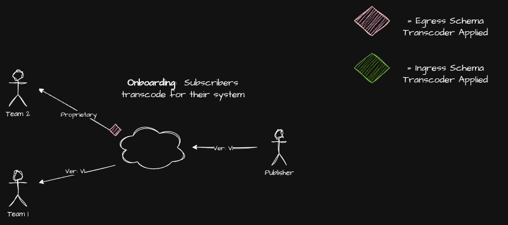
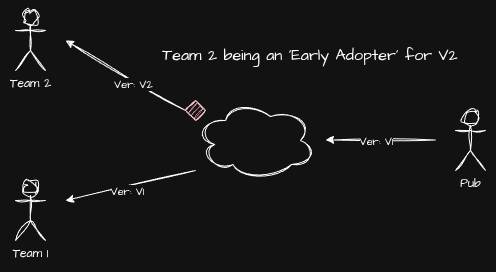
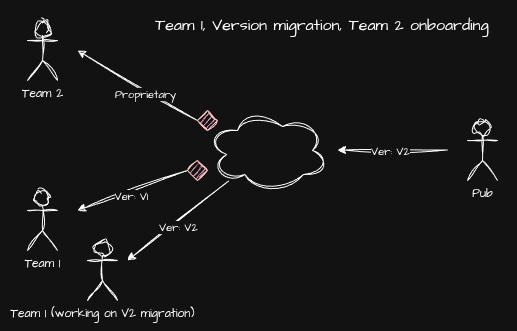
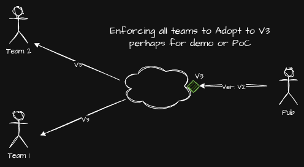

# What is splatcast.io
Splatcast is a pub sub for json documents that allows users to register 'transformers' (javascript code snippets) to 
transcode json documents. This enables publishers and subscribers (or consumers) of the json data to massage json docs 
to formats going to/from other systems to process.  This eases integration pains of different systems by different teams 
and enabled teams to move at their own pace when working towards integration and compliance.  As an example, let's say 
you have a restaurant with various systems like a POS, a printer, a payment device/CC terminal and a display board that 
shows order details.  The whole restaurant understands what a food 'order' is, but different systems may need that order
data in slightly different json format. This means that some transcoding has to happen "somewhere", 
splatcast is that "somewhere".

In other words, the problem is...
 - Different systems with different teams may speak different “dialects” of a similar json document within the same
   knowledge domain.
 - Different teams with different systems means Schema fragmentation issues.
 - Schema changes ripple through the ecosystem and complicating deployments and making teams resistant to change
 - Inconsistent validation and ad-hoc transforms cause data quality issues and outages.
 - Slow time-to-value: New teams or apps wait on bespoke ETL delay launches and experiments.

Siloing json document transcoding to a dedicated endpoint means...
- Changes to formats or new revisions can be done "hot", no need to "deploy" new revisions of a system everytime a
  json doc change happens. There's flexibility is having a degree of separation.
- When different systems are being integrated they can baby step their integration by massaging docs little by little
  as they integrate.
- When json document revisions are published, integrators are empowered to migrate at their own pace.

# How It Works
<b>Publish</b>: Producer posts a JSON payload labeled with its schema. Optionally the publisher can ask the server to 
transform to certain target schemas.

<b>Subscribers</b>: Subscribers can get docs as-is or ask the server to apply a registered transformer to massage
the data.

### Onboarding a new system into an existing one


### A team starting an early adaptor of a new json doc revision


### A team supporting an existing json doc revision and working on a migration to a new schema version


### A team providing a new revision on all subscribers/consumers.


# API Documentation
The Splatcast API Swagger documentation is available at:
- https://parrishsteve.github.io/splatcast/


# How Do You Get Started? 
 - Define an 'application' 
 - Define and register a 'schema'
 - Create a 'topic'
 - Have one endpoint subscribe to the topic via a websocket connection. Use any websocket client you want!
 - Have another endpoint publish a jons doc to the 'topic' via a REST API request. First demonstrate a basic pub-sub 
 - After that, try registering a 'transformer' to modify json docs on the fly!

### Create an App
```
curl -i -X POST http://localhost:8080/apps \
-H "Content-Type: application/json" \
-d '{"name": "MyNewApp"}'
```

### Register a Schema 
```
curl -i -X POST http://localhost:8080/apps/by-name/MyNewApp/schemas \
-H "Content-Type: application/json" \
-d '{
"name": "Test-2.0",
"jsonSchema": {
    "type": "object",
    "properties": {
        "userId": {
            "type": "string"
        },
        "timestamp": {
            "type": "string",
            "format": "date-time"
        },
        "metadata": {
            "type": "object"
        }
    }
},
"status": "draft"
}'
```

### Create a Topic: Note the default schema name is the same as the schema you just created above.   
```
curl -i -X POST http://localhost:8080/apps/by-name/MyNewApp/topics -H "Content-Type: application/json" \
-d '{
  "name": "MyNewTopic",
  "description": "User activity events",
  "defaultSchemaName": "Test-2.0",
}'
```

### Subscribe To The topic: Use any websocket client you want. For example...
```
wscat -c ws://localhost:8080/apps/by-name/MyNewApp/topics/MyNewTopic/subscribe
```

### Now Publish!
```
curl -i -X POST "http://localhost:8080/apps/by-name/MyNewApp/topics/MyNewTopic/publish" \
-H "Authorization: Bearer <TOKEN>" \
-H "Content-Type: application/json" \
-d '{
       "schemaName": "Test-2.0",
       "data": {
         "userId": 123,
         "action": "signup",
         "metadata": { "source": "web" }
    }
}'
```

# So How Are Docs Transformed? 
 - Register a new schema to transform to
 - Register your javascript code to perform the transformation
 - Then subscribe to the same topic but ask for the json doc to be transformed
  
### Register A New Schema Definition: note the new 'Test-3.1'
```
curl -i -X POST http://localhost:8080/apps/by-name/MyNewApp/schemas \
-H "Content-Type: application/json" \
-d '{
"name": "Test-3.1",
"jsonSchema": {
    "type": "object",
    "properties": {
      "heyyou": {
          "type": "string"
       },
    }
},
"status": "draft"
}'
```

### Now Register The Transformer:  Transform 'Test-2.0' -> 'Test-3.1' 
```
curl -i -X POST "http://localhost:8080/apps/by-name/MyNewApp/topics/MyNewTopic/transformers" \
-H "Authorization: Bearer <TOKEN>" \
-H "Content-Type: application/json" \
-d '{
    "name": "MyNewTransformer",
    "fromSchemaName": "Test-2.0",
    "toSchemaName": "Test-3.1",
    "code": "function transform(input) {
               const newValue = {
                   Heyyou: 'Here is a value from the original doc:' + input.action,
               }
               return newValue;
             }",
    "timeoutMs": 5000,
    "enabled": true
    }'
```

### Let's Subscribe!: specify the schema we want and get the transformation
```
wscat -c ws://localhost:8080/apps/by-name/MyNewApp/topics/MyNewTopic/subscribe?schemaName=Test-3.1
```

# FAQ
 - <b>What's the 'by-name' in the URL mean?</b> You can refer to apps, schemas, topics and transformers by name, making
   integration details easy to remember, user and share with other teams.  Alternatively you can use "IDs" for apps,
   topics, schemas and transformer. Note there is a slight performance improvement when you use an ID to reference apps, 
   schemas, topics and transformers. We recommend that you use 'names' at first, then as your implementations mature,
   start using the IDs. 
 - <b>Can you 'replay' docs when you subscribe?</b>. Yep, you can specify a timestamp when subscribing and get json doc 
   history replayed to the subscriber, for example if a system wen t down or was restarted, it could request to replay 
   messages and process json docs is may have missed while offline.    
 - <b>What is the retention time for json documents</b> It is by default 7 days, at the moment this is not configurable,
   but we are working on it.
 - <b>Can documents be transformed when publishing?</b> You bet, in the example described above the tsnformation is
   done when the json document is being delivered to the subscriber that requested the transformation, however, as 
   described in the example diagrams, it can also happen as the point of publication so the doc is transformed 
   before going to any subscriber.  See swagger docs for more information.  


# TODO - What Are We Adding Next? 
 - Security updates: Support authentication and token management to scope access of apps to a token.
 - Https support.
 - Make the doc retention time configurable and easy to configure.

## Licensing
Splatcast core source code is licensed under the [MIT License](./LICENSE).

This project uses third-party components, including:
- [Apache Kafka](https://kafka.apache.org/) (Apache License 2.0)
- [Apache ZooKeeper](https://zookeeper.apache.org/) (Apache License 2.0)

See [THIRD_PARTY_NOTICES.md](./THIRD_PARTY_NOTICES.md) for details.
